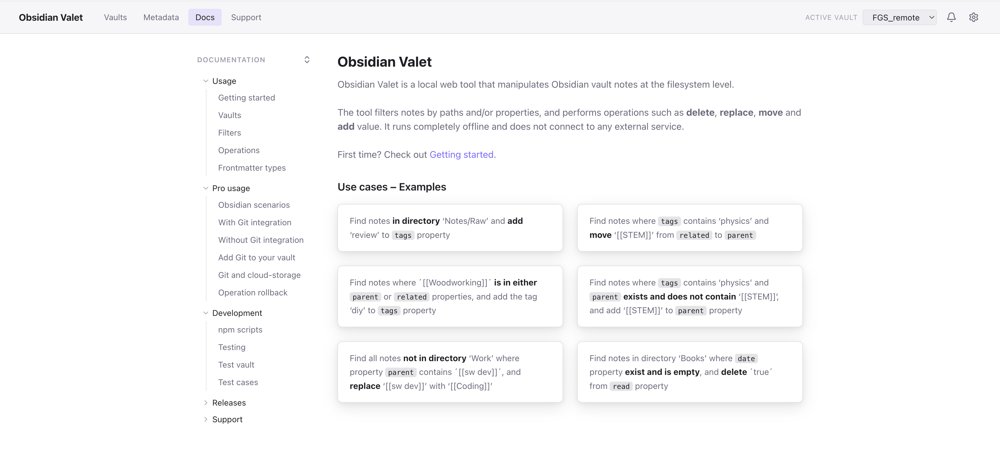
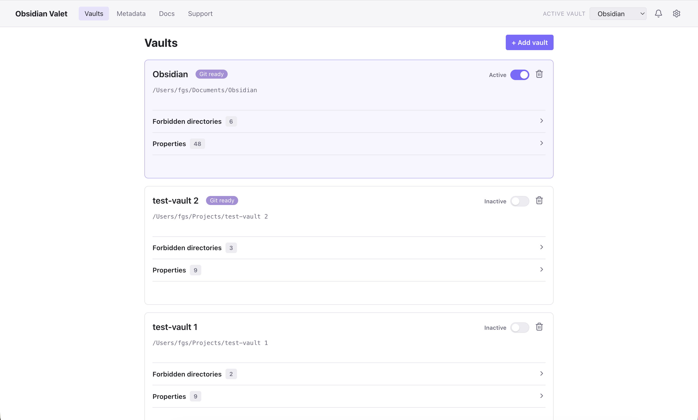
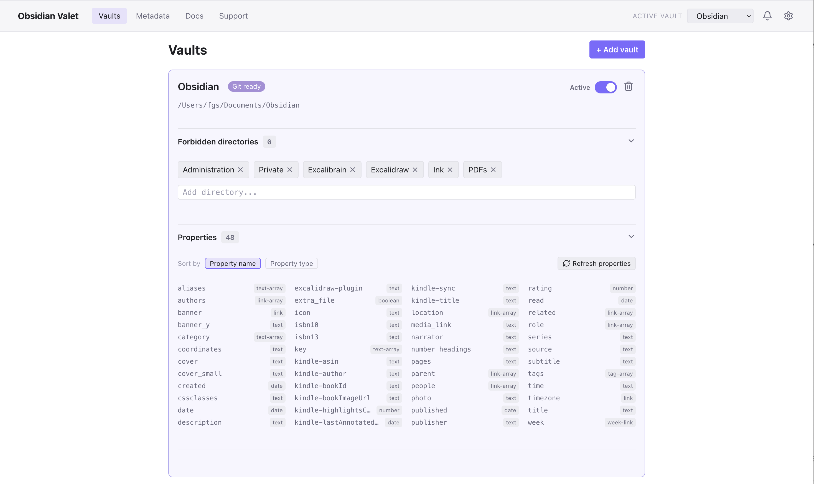
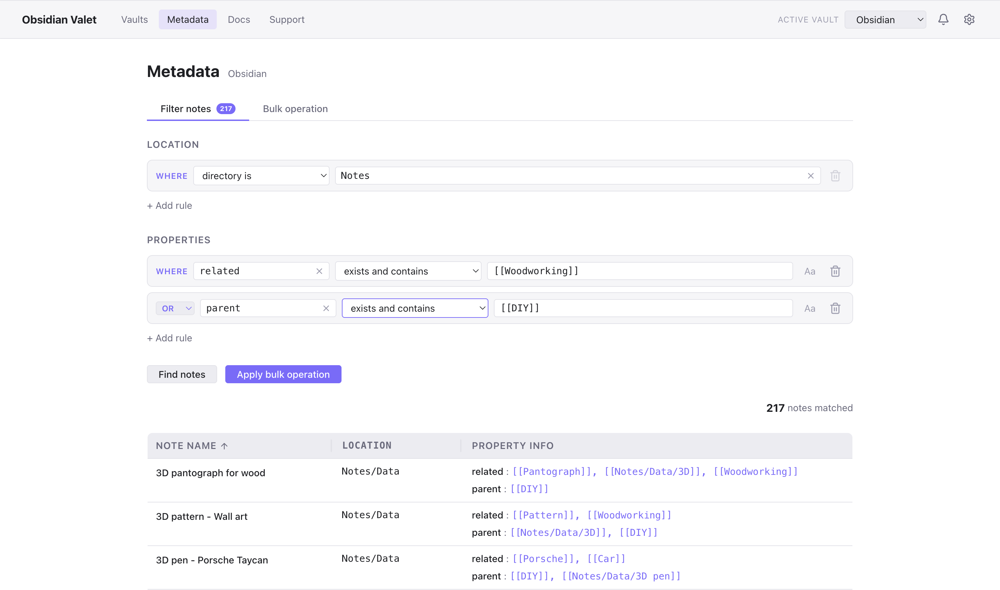
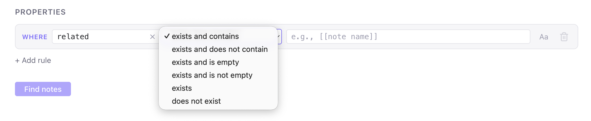
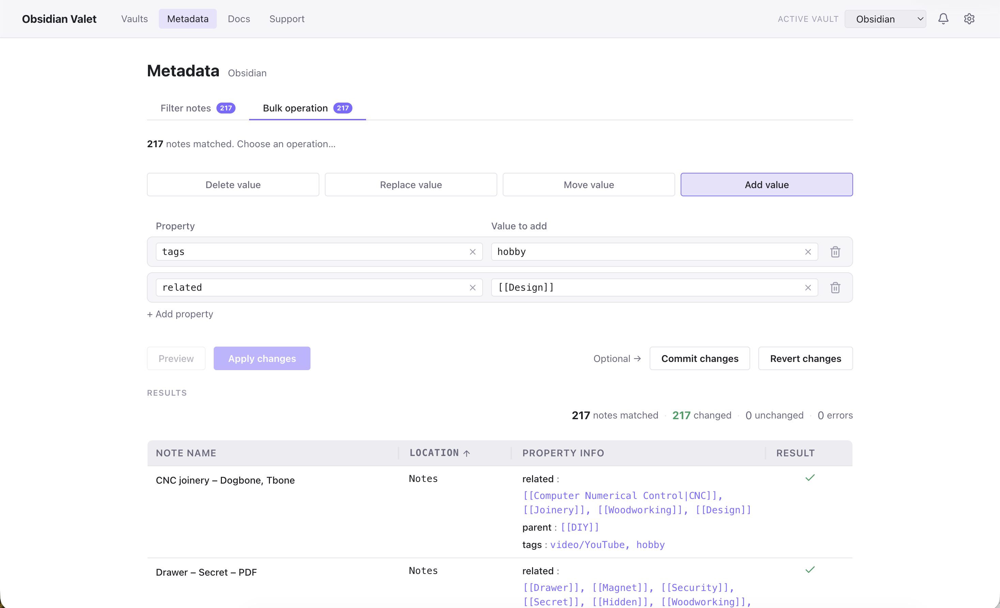
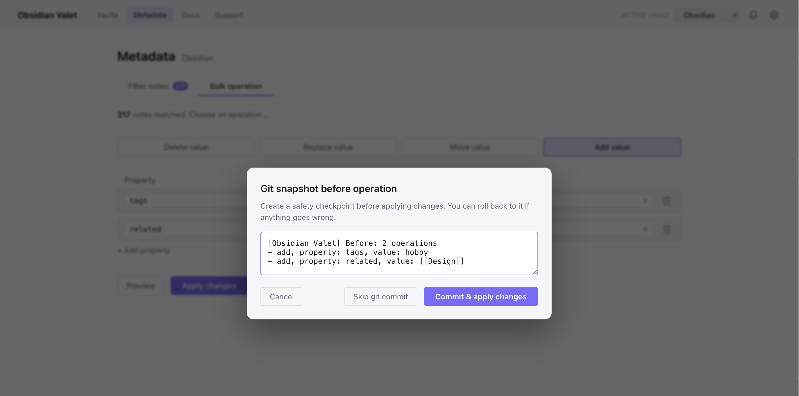

# Obsidian Valet

[](https://github.com/fgsanz/obsidian-valet/releases/latest)
[](LICENSE.md)

**Obsidian Valet** is a local web tool (any browser) for bulk manipulation of [Obsidian](https://obsidian.md/) vault notes based on YAML frontmatter properties.

## Motivation

**The problem:**
Knowledge management is not static; it evolves as you do. Over years of note-taking, your organizational style changes. You fluctuate between tags and links, rethink your metadata properties, and constantly shift how densely connected your notes are. Ultimately, this creates an unoptimized network topology where organic insights and connections struggle to form.

**The motivation:**
Obsidian Valet helps you realign your vault with your current thinking style. By giving you the power to reshape the topology of your vault, it ensures your notes remain highly discoverable. Whether you are browsing visually or leveraging modern local AI tools (like semantic search and RAG embeddings), Obsidian Valet assists you in reshaping your vault so that hidden, emergent connections can actually surface.

## What it does

Obsidian Valet...

- Filters notes by directory and property values (e.g., links, tags, dates, text)
- Applies bulk operations across matched notes: delete a value, change a value, or move a value between properties
- Leverages Git to take safety checkpoints before and after every operation — in case a rollback is needed
- Works entirely offline — no external services, no information is shared outside your computer, and no AI tokens are spent

## Demo

(video coming soon)

## Screens

First of all, there is a lot of documentation within the tool: 



You can define multiple vaults:



You can constrain the working directories, by defining forbidden directories. It also offers a nice view of the properties and their respective type:



You can find a group of notes that match a filter criteria that combines directories and metadata properties — YAML, frontmatter. You can combine the rules with `AND` and `OR` logical operators.



And for each property there are several ways to match it:



When you are ready with the group of notes, you can apply bulk operations (delete, replace, move, add) to one or several properties at once:



If you configured Git in your vault, Obsidian Valet will assist you in making safe snapshots (Git commits) before and after the bulk operation:



There is more functionality coming. Stay tuned.


## Installation

You do not need to be a developer to use **Obsidian Valet** 👍

This is a graphical tool and there is no coding involved. Only the installation requires some file and commands manipulation. You can either download the tool (and decompress it somewhere locally) or clone the tool repository (if you prefer Git commands), then run the tool from the command line and use it on your browser. All steps are explain bellow.

### Requirements

For the tool to run, you need the following:

- Node.js 20+ [Official instructions](https://nodejs.org/en/download)
- npm [Official instructions](https://docs.npmjs.com/cli/v9/configuring-npm/install)
- Git [Official instructions](https://git-scm.com/install/) (Optional, see below)

### Get the tool

There are two options...

#### Option 1 – Clone the repository

```sh
git clone https://github.com/fgsanz/obsidian-valet.git
cd obsidian-valet
npm install
```

Now, before launching Obsidian Valet, you can optionally add a extra safety rollback for changes you will make with the tool. Check out the section [Optional – Configure Git in your Obsidian vault for safe rollback](#optional--configure-git-in-your-obsidian-vault-for-safe-rollback) and then head to [Run the tool](#run-the-tool).

#### Option 2 – Download a release and decompress it

- Download a release archive from the [latest release](https://github.com/fgsanz/obsidian-valet/releases/latest)
- Unzip it locally, anywhere you want, the tool is self-contained
- Open a terminal/console window, go inside the extracted folder and execute the following command:

```sh
npm install
```

## Run the tool

Open a terminal/console window, go inside the extracted folder and execute the following command:

```sh
npm start
```

The server starts typically on port `3741` (or the next available port) and opens the app in your browser. The app also prints the URL to the console.

Follow your intuition and get cracking. Alternatively, check out the Docs section.

## [Optional] – Configure Git in your Obsidian vault for safe rollback

If you setup Git in your local vault, Obsidian Valet can use Git to safely (and optionally) push local commits before and after performing bulk operations, in case you decide to roll them back.

> You can also do this later. Inside the tool, there is plenty of documentation explaining strategic ways to address an Obsidian setup on multiple devices which sync. So, upon doubt, launch the tool now and decide later.

Obsidian Valet is **safe**, meaning it will not corrupt your notes. Regardless, to play extra safe, it is recommended that you run Git in your Obsidian vault. This is also safe and **no information leaves your computer** unless you also decide to push the vault to GitHub/Gilab in the cloud.

> Safe rollbacks, locally.

Open a terminal/console window, go inside your Obsidian vault and execute the following command:

```sh
cd {path to your Obsidian vault}
git init 
```

Likely, you consume the same Obsidian vault in different devices (e.g., laptop, phone). Obsidian stores per-device UI state info inside the `.obsidian` folder. You usually do not want that churn in your history. Create a `.gitignore` file in the root of the vault and add the following content:

```
# Obsidian local/workspace state
.obsidian/workspace.json
.obsidian/workspace-mobile.json
.obsidian/cache
.trash/

# OSX noise (if you use MacOS)
.DS_Store

# If you use Smart plugins (Connections, Context, Lookup, ...)
.smart-env
```

Keep the rest of `.obsidian` (your plugins and settings) tracked if you want them versioned, or ignore the whole folder if you only care about note content. Just consider that keeping track of changes in plugins and settings might come in handy some day.

Enable tracking of your note files:

```
git add -A
git commit -m "Initial snapshot of the vault"
```

That's it. The vault is now version-controlled. From this point on, Obsidian Valet will detect the repository and offer the snapshot/commit/revert steps automatically.

## New releases

- [Releases page](https://github.com/fgsanz/obsidian-valet/releases)
- [Latest release](https://github.com/fgsanz/obsidian-valet/releases/latest)

See [CHANGELOG.md](CHANGELOG.md) for changes in each version.

## For developers

Running the tool this way automatically takes on the changes you made to the source code:

```sh
npm run dev
```

Runs Vite dev server (port `5173`) and the API server (port `3741`) concurrently with hot reload.

### Project structure

```
src/
  shared/      # Types, schemas, and constants shared between server and client
  server/      # Fastify API server — config, routes, services
  client/      # React frontend — pages, components, API client
docs/          # Documentation served by the app at /docs
scripts/       # check-docs.ts — validates docs coverage
tests/         # Test cases, written BDD style, unit test, interaction tests
```

### Configuration

<!-- BEGIN GENERATED: configuration (source: docs/configuration.md — run `npm run sync-readme`) -->
Your configuration — the vaults you've added, their forbidden directories and discovered properties, and which vault is active — is saved in a `config.json` file.

Obsidian Valet runs on Linux, macOS, and Windows, and on each system it stores `config.json` in the platform's standard per-user application config directory:

| OS | Location | Comment |
|----|----------|---------|
| **Linux** | `$XDG_CONFIG_HOME/obsidian-valet/config.json` | defaults to `~/.config/obsidian-valet/config.json` |
| **macOS** | `~/Library/Application Support/obsidian-valet/config.json` | |
| **Windows** | `%APPDATA%\obsidian-valet\config.json` | e.g. `C:\Users\<you>\AppData\Roaming\obsidian-valet\config.json` |

The location is detected automatically at runtime, so no setup is needed. A few things worth knowing:

- It lives in your **home/user profile**, not inside the cloned repository — so updating the tool (`git pull` or downloading a new release) never touches your configuration.
- The folder and file are created automatically the first time you add a vault; you normally never edit them by hand.
- It only ever references your own machine — nothing is sent anywhere.
<!-- END GENERATED: configuration -->
